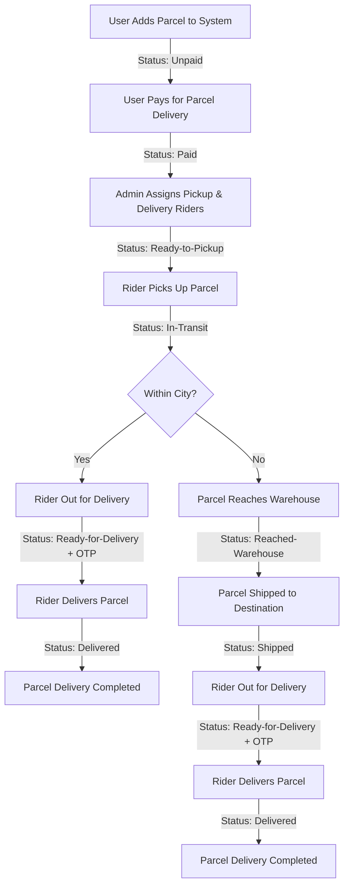
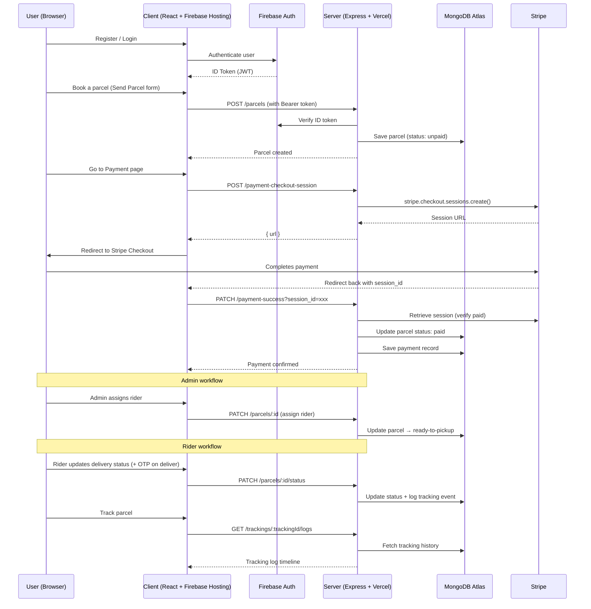

# 📦 Zap Shift — Parcel Management & Courier Platform

**Live Client:** [https://zap-shift-737f5.web.app/](https://zap-shift-737f5.web.app/)  
**Live Server (API):** [https://zap-shift-server-delta-smoky.vercel.app/](https://zap-shift-server-delta-smoky.vercel.app/)  
**GitHub:** [github.com/kaziashik/zap-shift](https://github.com/kaziashik/zap-shift)

---

# Zap Shift Resources

Welcome to **Zap Shift** — a full-stack door-to-door parcel management & courier platform for Bangladesh (64 districts), with User, Admin, and Rider workflows, Stripe payments, Firebase Auth, and OTP-confirmed delivery.

---

## 📊 System Overview Table

| Role | Key Responsibilities | Earnings/Benefits |
| --- | --- | --- |
| **User** | Book parcels, pay charges, track status, review service | Real-time tracking, feedback after delivery |
| **Admin** | Assign riders, approve agents, monitor operations & analytics | System control, operational oversight |
| **Rider** | Collect/deliver parcels, update status, OTP confirmation, warehouse handoff | ৳ **80%** same city · **60%** outside city |

---

## 🛒 Pricing Structure

| Parcel Type | Weight | Within City | Outside City/District |
| --- | --- | --- | --- |
| **Document** | Any | ৳60 | ৳80 |
| **Non-Document** | Up to 3kg | ৳110 | ৳150 |
| **Non-Document** | >3kg | +৳40/kg | +৳40/kg +৳40 extra |

Pricing is calculated on the client and **re-validated on the server** when a parcel is created.

---

## 🚚 Delivery Workflow



---

## 🗂️ Key Features

- Automated pricing & tracking
- Role-based access & workflow (User / Admin / Rider)
- OTP-based secure delivery confirmation
- Nationwide coverage (64 districts)
- Transparent rider commission (80% / 60%)
- Stripe Checkout payments (server verifies with Stripe before marking paid)
- Post-delivery service reviews
- Light / dark theme, explore, coverage map, blog, contact

---

## 🙋 About This Project

ZapShift was built to digitize door-to-door courier operations in Bangladesh: clear pricing, paid bookings, admin rider assignment, rider status updates (including warehouse handoff for inter-district), and OTP-confirmed delivery — all in one Firebase + Express + MongoDB stack.

---

## 🏗️ System Architecture — How Everything Talks to Each Other



**In short:** Firebase handles who you are, the Express server (guarded by Firebase token verification) handles what you're allowed to do, MongoDB stores parcel/user/rider/payment/review data, and Stripe handles money — the server only marks something **paid** after double-checking with Stripe.

---

## 🧰 Tech Stack

### Frontend (`frontend/`)

| Technology | Purpose |
| --- | --- |
| **React 19** | Core UI library |
| **Vite** | Dev server & build tool |
| **Tailwind CSS + DaisyUI** | Styling |
| **React Router** | Public, private, Admin/Rider routes |
| **TanStack Query** | Server-state caching & refetch |
| **Axios** | HTTP + secure Firebase token instance |
| **Firebase Auth** | Email/password + Google login |
| **React Hook Form** | Form validation |
| **Leaflet / React-Leaflet** | Coverage maps |
| **Recharts** | Admin/Rider dashboard charts |
| **SweetAlert2** | Alerts / OTP / confirmations |
| **Swiper / Carousel** | Homepage sliders |
| **Motion** | Light UI animation |

### Backend (`backend/`)

| Technology | Purpose |
| --- | --- |
| **Node.js + Express** | REST API |
| **MongoDB (native driver)** | users, parcels, payments, riders, trackings, contacts, reviews |
| **Firebase Admin SDK** | Verify Firebase ID tokens |
| **Stripe** | Checkout Sessions |
| **CORS + dotenv** | Cross-origin + env config |
| **Vercel** | API hosting |

---

## 📁 Folder Structure (MVP)

```text
zap-shift/
├── frontend/          # React + Vite client
├── backend/           # Express + MongoDB API
├── resources/         # Specs, Postman, data, animations
├── README.md
├── package.json       # Root helper scripts
└── .gitignore
```

### Backend — `backend/`

```text
backend/
├── config/            # database.js, firebase.js
├── controllers/       # parcel, payment, rider, tracking, user, contact, review
├── middleware/        # auth, collections, logging, validate, errorHandler
├── models/
├── routes/
├── utils/             # trackingId, pricing, deliveryStatus
├── index.js
├── package.json
└── vercel.json
```

### Frontend — `frontend/`

```text
frontend/
└── src/
    ├── components/
    ├── contexts/          # Auth + Theme
    ├── data/              # serviceCenters, services, reviews
    ├── firebase/
    ├── hooks/             # useAuth, useAxios, useAxiosSecure, useRole
    ├── layouts/
    ├── pages/             # Home, Auth, Coverage, Dashboard, SendParcel, …
    └── routes/            # PrivateRoute, AdminRoute, RiderRoute, router
```

---

## 🔌 API Endpoints

**Base URL (production):** `https://zap-shift-server-delta-smoky.vercel.app`  
**Local:** `http://localhost:5001`

### Users — `/users`

| Method | Endpoint | Auth | Description |
| --- | --- | --- | --- |
| GET | `/users` | 🔒 Token | Get users (search) |
| GET | `/users/:id` | 🔒 Token | Get user by ID |
| GET | `/users/:email/role` | 🔒 Token | Get role by email |
| POST | `/users` | Public | Create user |
| PATCH | `/users/:id/role` | 🔒 Admin | Update role |

### Parcels — `/parcels`

| Method | Endpoint | Auth | Description |
| --- | --- | --- | --- |
| GET | `/parcels` | 🔒 Token | List parcels |
| GET | `/parcels/rider` | 🔒 Rider | Rider’s parcels |
| GET | `/parcels/delivery-status/stats` | 🔒 Admin | Status counts for charts |
| GET | `/parcels/:id` | 🔒 Token | Parcel by ID |
| POST | `/parcels` | 🔒 Token | Create (server pricing check) |
| PATCH | `/parcels/:id/status` | 🔒 Token | Update status (+ OTP on deliver) |
| PATCH | `/parcels/:id` | 🔒 Admin | Assign rider → `ready-to-pickup` |
| DELETE | `/parcels/:id` | 🔒 Token | Delete (owner unpaid / admin) |

### Payments

| Method | Endpoint | Auth | Description |
| --- | --- | --- | --- |
| POST | `/payment-checkout-session` | 🔒 Token* | Create Stripe session |
| PATCH | `/payment-success` | Public | Verify Stripe + mark `paid` |
| GET | `/payments` | 🔒 Token | Payment history |

\*Client sends Firebase token via secure axios.

### Riders — `/riders`

| Method | Endpoint | Auth | Description |
| --- | --- | --- | --- |
| GET | `/riders` | 🔒 Token | List riders |
| GET | `/riders/delivery-per-day` | 🔒 Rider | Daily delivery stats |
| POST | `/riders` | Public | Apply as rider (pending) |
| PATCH | `/riders/:id` | 🔒 Admin | Approve / update status |

### Trackings — `/trackings`

| Method | Endpoint | Auth | Description |
| --- | --- | --- | --- |
| GET | `/trackings/:trackingId/logs` | Public/Token | Tracking timeline |

### Reviews — `/reviews`

| Method | Endpoint | Auth | Description |
| --- | --- | --- | --- |
| GET | `/reviews` | Public | List reviews |
| POST | `/reviews` | 🔒 Token | Review a delivered parcel |

> 🔒 **Token** = `Authorization: Bearer <Firebase ID token>`  
> **Admin/Rider** = role checked in MongoDB after token verify.

---

## ⚙️ Installation Guide

### 1. Clone

```bash
git clone https://github.com/kaziashik/zap-shift.git
cd zap-shift
```

### 2. Backend

```bash
cd backend
npm install
```

Create `backend/.env`:

```env
PORT=5001
DB_USER=
DB_PASS=
FB_SERVICE_KEY=
STRIPE_SECRET_KEY=
SITE_DOMAIN=http://localhost:5173
```

```bash
npm run dev
```

### 3. Frontend

```bash
cd frontend
npm install
```

Create `frontend/.env`:

```env
VITE_apiKey=
VITE_authDomain=
VITE_projectId=
VITE_storageBucket=
VITE_messagingSenderId=
VITE_appId=
VITE_API_URL=http://localhost:5001
VITE_image_host_key=
```

```bash
npm run dev
```

Client: `http://localhost:5173` · API: `http://localhost:5001`

### Root helpers

```bash
npm run install:all
npm run dev:backend
npm run dev:frontend
```

---

## 👤 Demo Credentials (Submission)

| Role | Email | Password |
| --- | --- | --- |
| **Admin** | `demo@zapshift.com` | `Demo@12345` |
| **User / Customer** | `user@zapshift.com` | `User@12345` |
| **Rider** | `rider@zapshift.com` | `Rider@12345` |

Use **Demo login (auto-fill)** on the Login page for the admin account, or sign in manually with either role above.

### Final  links

- **Live Website:** https://zap-shift-737f5.web.app/
- **Live API:** https://zap-shift-server-delta-smoky.vercel.app/
- **GitHub (Frontend + Backend):** https://github.com/kaziashik/zap-shift

---

## 👤 Author

**Ashik (kaziashik)**  
GitHub: [github.com/kaziashik](https://github.com/kaziashik)
