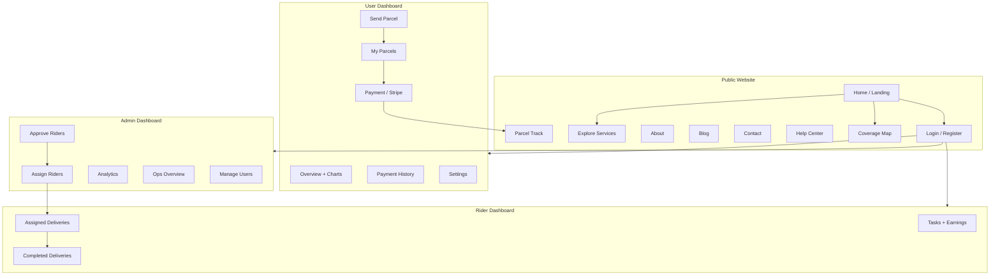
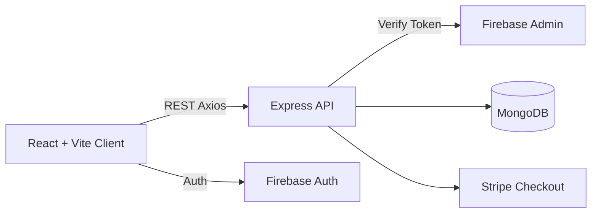
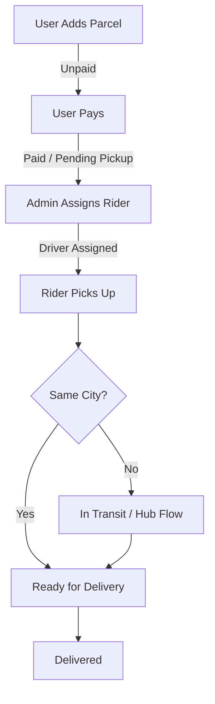

# ZapShift

**Door-to-door parcel delivery platform for Bangladesh**

ZapShift is a full-stack logistics web application that streamlines parcel booking, payment, rider assignment, tracking, and delivery for homes and offices across 64 districts.

**Live repo:** [github.com/kaziashik/zap-shift](https://github.com/kaziashik/zap-shift)

---

## Table of Contents

1. [Project Overview](#1-project-overview)
2. [Problem Statement](#2-problem-statement)
3. [Key Features](#3-key-features)
4. [User Roles & How to Use](#4-user-roles--how-to-use)
5. [Website Overview (Mermaid)](#5-website-overview-mermaid)
6. [Delivery Workflow](#6-delivery-workflow)
7. [Pricing Structure](#7-pricing-structure)
8. [Tech Stack](#8-tech-stack)
9. [Folder Structure](#9-folder-structure)
10. [Local Setup Guide](#10-local-setup-guide)
11. [Environment Variables](#11-environment-variables)
12. [Demo Login](#12-demo-login)
13. [API Overview](#13-api-overview)

---

## 1. Project Overview

ZapShift connects three roles in one platform:

| Role | Purpose |
|------|---------|
| **User** | Books parcels, pays delivery charges, tracks shipments |
| **Admin** | Approves riders, assigns deliveries, monitors operations |
| **Rider** | Picks up and delivers parcels, updates status |

The product includes:

- Public marketing website (home, services, coverage map, blog, contact)
- Secure authentication (email/password + Google)
- Role-based dashboards with charts and tables
- Dynamic parcel pricing
- Stripe checkout payments
- Real-time style tracking timeline
- Light / dark theme support

---

## 2. Problem Statement

Traditional courier workflows in Bangladesh often suffer from:

- Manual booking and unclear pricing
- Poor visibility after a parcel leaves the sender
- Weak coordination between pickup riders, hubs, and delivery riders
- No single place for customers, admins, and field riders to collaborate

**ZapShift solves this** by providing an end-to-end digital system where:

1. Users create accurate door-to-door bookings
2. Cost is calculated instantly by type, weight, and city
3. Payment unlocks a unique tracking ID
4. Admins assign riders and oversee operations
5. Riders update parcel movement until final delivery

---

## 3. Key Features

- Automated pricing for document / non-document parcels
- Nationwide coverage data (64 districts / service centers)
- Role-based dashboards (User, Admin, Rider)
- Stripe card payment integration
- Tracking timeline by tracking ID
- Explore page with search, filters, sorting, pagination
- Contact form with server-side validation
- Responsive UI + light/dark mode
- Firebase Authentication (email + Google)

---

## 4. User Roles & How to Use

### 4.1 User (Customer)

1. Register / Login
2. Go to **Send a Parcel**
3. Fill parcel, sender, and receiver details
4. Confirm calculated cost and create booking
5. Pay from **My Parcels**
6. Track status from tracking ID / dashboard
7. Update profile from **Settings**

### 4.2 Admin

1. Login with an admin account
2. Open **Dashboard → Overview / Analytics**
3. **Approve Riders** (pending applications)
4. **Assign Riders** to paid parcels
5. **Manage Users** (make admin / remove admin)
6. Monitor payments and parcel status charts

### 4.3 Rider

1. Apply from **Be a Rider** (pending until admin approval)
2. After approval, open Rider dashboard
3. View **Assigned Deliveries**
4. Update pickup / delivery status
5. Check completed deliveries and earnings estimate

---

## 5. Website Overview (Mermaid)



### High-level system architecture



---

## 6. Delivery Workflow



---

## 7. Pricing Structure

| Parcel Type | Weight | Within City | Outside City / District |
|-------------|--------|-------------|-------------------------|
| Document | Any | ৳60 | ৳80 |
| Non-Document | Up to 3kg | ৳110 | ৳150 |
| Non-Document | > 3kg | +৳40/kg | +৳40/kg + ৳40 extra |

Rider commission (display logic):

- Same city: about **80%** of parcel cost
- Outside city: about **60%** of parcel cost

---

## 8. Tech Stack

### Frontend (`client/`)

| Area | Technology |
|------|------------|
| UI Library | **React 19** |
| Build Tool | **Vite 7** |
| Routing | **React Router 7** |
| Styling | **Tailwind CSS 4 + DaisyUI 5** |
| Animation | **Motion** |
| Forms | **React Hook Form** |
| Data Fetching | **TanStack Query + Axios** |
| Charts | **Recharts** |
| Maps | **Leaflet / React-Leaflet** |
| Auth Client | **Firebase Auth** |
| Payments UI flow | Stripe Checkout (via backend) |
| Alerts | SweetAlert2 |
| Icons | React Icons |

### Backend (`server/`)

| Area | Technology |
|------|------------|
| Runtime | **Node.js** |
| Framework | **Express 5** |
| Database | **MongoDB** (official Node driver) |
| Auth verification | **Firebase Admin SDK** |
| Payments | **Stripe** |
| Config | **dotenv** |
| Cross-origin | **CORS** |

### Styling approach

- Utility-first styling with **Tailwind CSS**
- Component themes with **DaisyUI** (`zs-light` / `zs-dark`)
- Brand colors: lime primary `#CAEB66`, teal secondary `#03373D`, accent teal
- Shared classes: `.zs-card`, `.zs-surface`, `.zs-btn-primary`

---

## 9. Folder Structure (MVP)

```text
zap-shift/
├── package.json                  # Root scripts (install/dev helpers)
├── README.md
├── .gitignore
├── client/                       # Frontend MVP (React + Vite)
├── server/                       # Backend MVP (Express + MongoDB)
└── resources/                    # Specs, assets, Postman, Figma refs
```

### Frontend structure

```text
client/
├── public/
│   ├── reviews.json
│   └── serviceCenters.json
├── src/
│   ├── assets/                   # Images, lottie JSON, brands
│   ├── components/
│   │   ├── CenterCard/
│   │   ├── Dashboard/            # StatCard, ProfileCard, StatusBadge
│   │   ├── Forbidden/
│   │   ├── Loading/
│   │   ├── Logo/
│   │   ├── ServiceCard/
│   │   ├── ThemeToggle/
│   │   └── ui/                   # SectionHeader, SkeletonCard
│   ├── contexts/
│   │   ├── AuthContext/
│   │   └── ThemeContext/
│   ├── data/
│   │   └── services.js           # Services, FAQ, blogs, stats
│   ├── firebase/
│   │   └── firebase.init.js
│   ├── hooks/
│   │   ├── useAuth.jsx
│   │   ├── useAxios.jsx
│   │   ├── useAxiosSecure.jsx
│   │   ├── usePagination.js
│   │   ├── useRole.jsx
│   │   └── useTheme.jsx
│   ├── layouts/
│   │   ├── AuthLayout.jsx
│   │   ├── DashboardLayout.jsx
│   │   └── RootLayout.jsx
│   ├── pages/
│   │   ├── About/
│   │   ├── Auth/                 # Login, Register, SocialLogin
│   │   ├── Blog/
│   │   ├── Contact/
│   │   ├── Coverage/
│   │   ├── Dashboard/
│   │   │   ├── Analytics/
│   │   │   ├── ApproveRiders/
│   │   │   ├── AssignRiders/
│   │   │   ├── AssignedDeliveries/
│   │   │   ├── CompletedDeliveries/
│   │   │   ├── DashboardHome/
│   │   │   ├── MyParcels/
│   │   │   ├── Payment/
│   │   │   ├── PaymentHistory/
│   │   │   ├── Settings/
│   │   │   └── UsersManagement/
│   │   ├── Explore/
│   │   ├── Help/
│   │   ├── Home/                 # Banner, Features, FAQ, CTA...
│   │   ├── NotFound/
│   │   ├── ParcelTrack/
│   │   ├── Rider/
│   │   ├── ServiceDetails/
│   │   ├── Shared/               # NavBar, Footer
│   │   └── sendParcel/
│   ├── routes/
│   │   ├── router.jsx
│   │   ├── PrivateRoute.jsx
│   │   ├── AdminRoute.jsx
│   │   └── RiderRoute.jsx
│   ├── index.css
│   └── main.jsx
├── package.json
└── vite.config.js
```

### Backend structure

```text
server/
├── config/
│   ├── database.js               # MongoDB connection
│   └── firebase.js               # Firebase Admin init
├── controllers/
│   ├── contactController.js
│   ├── parcelController.js
│   ├── paymentController.js
│   ├── riderController.js
│   ├── trackingController.js
│   ├── userController.js
│   └── index.js
├── middleware/
│   ├── auth.js                   # verifyFBToken, verifyAdmin, verifyRider
│   ├── collections.js
│   ├── errorHandler.js
│   ├── logging.js
│   └── validate.js
├── models/
│   ├── Contact.js
│   ├── Parcel.js
│   ├── Payment.js
│   ├── Rider.js
│   ├── Tracking.js
│   ├── User.js
│   └── index.js
├── routes/
│   ├── contact.js
│   ├── parcels.js
│   ├── payments.js
│   ├── riders.js
│   ├── trackings.js
│   └── users.js
├── utils/
│   └── trackingId.js
├── index.js                      # App entry
├── package.json
├── SETUP.md
└── .env                          # Local secrets (not committed)
```

---

## 10. Local Setup Guide

### Prerequisites

- Node.js **18+** (recommended 20+)
- npm
- MongoDB Atlas account (or local MongoDB)
- Firebase project (Authentication enabled)
- Stripe test account (for payments)
- Git

### Step 1 — Clone the repository

```bash
git clone https://github.com/kaziashik/zap-shift.git
cd zap-shift
```

### Step 2 — Install dependencies

From the project root:

```bash
npm run install:all
```

Or manually:

```bash
cd server
npm install
cd ../client
npm install
```

### Step 3 — Environment files

Create `server/.env` and `client/.env` (see [Environment Variables](#11-environment-variables)).

### Step 4 — Start the apps

Terminal 1 (API):

```bash
cd server
npm run dev
```

Terminal 2 (Frontend):

```bash
cd client
npm run dev
```

Or from root:

```bash
npm run dev:server
npm run dev:client
```

- Frontend: `http://localhost:5173`
- API: `http://localhost:5001`

> Tip: If port `5000` is already used by another app, keep ZapShift API on `5001`.

### Step 5 — Verify

1. Open Home page
2. Open Explore / Coverage
3. Register or use demo login
4. Create a parcel (logged in)
5. Check dashboard routes by role

### Useful scripts

**Root**

```bash
npm run install:all   # install client + server deps
npm run dev:client    # start Vite
npm run dev:server    # start Express
```

**Client (`client/`)**

```bash
npm run dev       # start Vite
npm run build     # production build
npm run preview   # preview build
```

**Server (`server/`)**

```bash
npm run dev       # start Express
npm start         # start Express
npm test          # basic route smoke checks
```

---

## 11. Environment Variables

### Frontend (`client/.env`)

```env
VITE_apiKey=your_firebase_api_key
VITE_authDomain=your_project.firebaseapp.com
VITE_projectId=your_project_id
VITE_storageBucket=your_project.appspot.com
VITE_messagingSenderId=your_sender_id
VITE_appId=your_app_id

VITE_API_URL=http://localhost:5001
VITE_image_host_key=optional_imgbb_key
```

### Backend (`server/.env`)

```env
PORT=5001

DB_USER=your_mongodb_user
DB_PASS=your_mongodb_password

STRIPE_SECRET_KEY=sk_test_xxxxxxxx
SITE_DOMAIN=http://localhost:5173

# Firebase Admin service account JSON (stringified / base64 style used by project)
FB_SERVICE_KEY=your_firebase_admin_json

CLIENT_URL=http://localhost:5173
```

> Never commit `.env` files. They are ignored by Git.

---

## 12. Demo Login

After creating the demo user in Firebase (or registering from UI):

| Field | Value |
|-------|--------|
| Email | `demo@zapshift.com` |
| Password | `Demo@12345` |

On the Login page, click **Demo login (auto-fill)** then **Login**.

To create an admin:

1. Register/login as a normal user
2. Update that user’s `role` to `admin` in MongoDB `users` collection  
   **or** use an existing admin account from **Users Management**

---

## 13. API Overview

Base URL (local): `http://localhost:5001`

| Method | Endpoint | Access | Description |
|--------|----------|--------|-------------|
| GET | `/` | Public | API health |
| POST | `/users` | Public | Create user profile |
| GET | `/users/:email/role` | Auth | Get role |
| GET | `/parcels` | Auth | List parcels |
| POST | `/parcels` | Auth | Create parcel |
| PATCH | `/parcels/:id/status` | Auth | Update delivery status |
| POST | `/payment-checkout-session` | Public/Auth flow | Create Stripe session |
| GET | `/payments` | Auth | Payment history |
| GET | `/riders` | Auth | List riders |
| POST | `/riders` | Public/Auth flow | Apply as rider |
| PATCH | `/riders/:id` | Admin | Approve/reject rider |
| GET | `/trackings/:trackingId/logs` | Public | Tracking timeline |
| POST | `/contact` | Public | Contact form |

More details: `resources/API_DOCUMENTATION.md`

---

## License

This project is for learning / portfolio use unless otherwise specified by the author.

---

## Author

Built as a production-style parcel logistics platform project — **ZapShift**.
